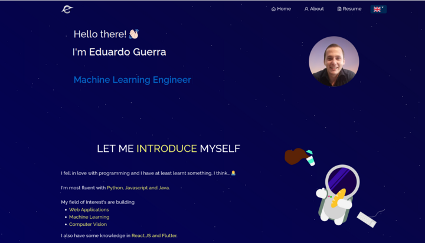

<h2 align="center">
  <a href="https://eduardoguerra.tech" target="_blank">Portfolio Website</a>
</h2>

  

## Built With

My <a href="https://eduardoguerra.tech" target="_blank">personal portfolio</a> which features some of my github projects as well as my resume and technical skills. 

This project was built using these technologies.

- React.js
- TypeScript
- Vite
- React-Bootstrap
- CSS
- React-i18next

## Features

This project code was adapted from [Soumyajit Behera](https://github.com/soumyajit4419/Portfolio). I have modified the code to fit my personal needs. The website has the following additional features:

1. Use [React-i18next](https://react.i18next.com/) to make the website multilingual. It is now available in English, Portuguese and French.
2. Added Typescript to the project to improve code quality and maintainability.
3. Replace [react-scripts](https://www.npmjs.com/package/react-scripts) (which has been discontinued) with [vite](https://vitejs.dev/) to eliminate some security vulnerabilities and improve performance.
4. Dockerized the project for easy development and deployment.

## Getting Started

Clone down this repository. To run the project locally, you have two options:

1. Without Docker:
1. Make sure you have Node.js installled. At the time of writing, the latest version is 20.11.1
1. Installation: `npm install`
1. In the project directory, you can run: `npm run dev`
1. With Docker:
1. Make sure you have Docker installed. At the time of writing, the latest version is 20.11.1
1. Make sure you have VSCODE installed.
1. You can use the [Dev Container](https://code.visualstudio.com/docs/devcontainers/create-dev-container) extension on your VS Code to run the project in a containerized environment.

Runs the app in the development mode.\
Open [http://localhost:5137](http://localhost:5137) to view it in the browser.
The page will reload if you make edits.

### Credits

Code base and styling was source from from [Soumyajit Behera](https://github.com/soumyajit4419/Portfolio)

Images were created by graphical designer [Julia Borges](https://www.linkedin.com/in/julia-gabriele-borges-damasceno/)
